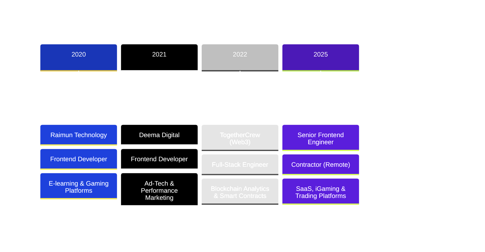

<div align="center">

<!-- Animated Header with Custom SVG -->


</div>

<!-- Typing Animation Effect -->
<div align="center">
  
[](https://git.io/typing-svg)

</div>

<br/>

<!-- Wave SVG Divider -->


## 👨‍💻 About Me


```typescript
const mehdi = {
    location: "Portugal 🇵🇹",
    experience: "6+ years",
    currentRole: "Senior Frontend Engineer",
    specialties: [
        "Full-Stack JavaScript Development",
        "Modern React Ecosystems",
        "Web3 & Smart Contracts",
        "SaaS & Trading Platforms",
        "Performance Optimization"
    ],
    currentlyWorkingOn: [
        "🎯 fanfunded.io - Scalable betting platform",
        "⚡ Trading & Bet Tracking Apps",
        "🚀 Next.js Architecture & Migration"
    ],
    funFact: "I've built everything from Web3 analytics " +
             "to iGaming platforms to trading trackers 🎰📈"
};
```

### 🎯 Quick Highlights

- 🔥 **6+ years** building modern web applications with **React**, **Next.js**, and **TypeScript**
- 🚀 Led **PHP/Vue.js → Next.js** migration for production platforms
- 🌐 Deep experience in **Web3**, **SaaS**, **iGaming**, and **Trading** domains
- 💎 Full-stack expertise: **React/Next.js** frontend + **Nest.js/PostgreSQL** backend
- 🛠️ Specialized in **performance optimization**, **scalable architecture**, and **CI/CD pipelines**

<br/>


## 🛠️ Tech Stack & Skills

<div align="center">

### 🎨 Frontend Development

<table>
<tr>
<td align="center" width="96">

<br>React
</td>
<td align="center" width="96">

<br>Next.js
</td>
<td align="center" width="96">

<br>TypeScript
</td>
<td align="center" width="96">

<br>Vue.js
</td>
<td align="center" width="96">

<br>Nuxt.js
</td>
<td align="center" width="96">

<br>Tailwind
</td>
<td align="center" width="96">

<br>Vite
</td>
</tr>
</table>

### ⚙️ Backend Development

<table>
<tr>
<td align="center" width="96">

<br>Nest.js
</td>
<td align="center" width="96">

<br>Node.js
</td>
<td align="center" width="96">

<br>PostgreSQL
</td>
<td align="center" width="96">

<br>MongoDB
</td>
<td align="center" width="96">

<br>Prisma
</td>
<td align="center" width="96">

<br>Redis
</td>
<td align="center" width="96">

<br>GraphQL
</td>
</tr>
</table>

### 🚀 DevOps & Tools

<table>
<tr>
<td align="center" width="96">

<br>Docker
</td>
<td align="center" width="96">

<br>GH Actions
</td>
<td align="center" width="96">

<br>Vercel
</td>
<td align="center" width="96">

<br>Git
</td>
<td align="center" width="96">

<br>Vitest
</td>
<td align="center" width="96">

<br>Jest
</td>
<td align="center" width="96">

<br>Grafana
</td>
</tr>
</table>

### 📚 Libraries & State Management


</div>

<br/>


## 📊 GitHub Statistics

<div align="center">
  


</div>

<div align="center">
  


</div>

<div align="center">
  
[](https://github.com/ryo-ma/github-profile-trophy)

</div>

<br/>


## 💼 Professional Journey

<div align="center">



</div>

### 🎯 Key Project Highlights

<table>
<tr>
<td width="50%">

#### 🎰 **fanfunded.io & playerprofit.com**


- 🔄 Led **PHP/Vue.js → Next.js/TypeScript** migration
- 🚀 Implemented **CI/CD pipelines** with GitHub Actions
- 🐳 Deployed with **Docker Compose**
- 📊 Built shared admin panel across platforms
- ⚡ Performance & scalability improvements

</td>
<td width="50%">

#### 🔗 **TogetherCrew (Web3 Platform)**


- 🌐 Built **Web3 analytics platform** for DAOs
- 📝 Developed **JavaScript SDK** for API integration
- ⛓️ Integrated **smart contracts** with Wagmi/Viem
- 🤖 Created **Discord bot** with LLM-powered QA
- 📈 Data visualization with Highcharts

</td>
</tr>
<tr>
<td width="50%">

#### 📊 **Bet Tracker & Trading Tracker**


- 📱 Built from scratch with **React + Vite**
- 🎨 Modern UI with **TailwindCSS + shadcn/ui**
- 🔧 State management: **Zustand + React Query**
- 📋 Form handling with **React Hook Form + Zod**
- 🏗️ Clean architecture & high performance

</td>
<td width="50%">

#### 🎓 **E-Learning & Ad-Tech Platforms**


- 🎮 Interactive gaming & education platforms
- 📊 Campaign analytics & reporting dashboards
- 🎥 Real-time video/voice communication
- 👨‍💼 Admin panels & content management systems
- 📈 Performance tracking & data visualization

</td>
</tr>
</table>

<br/>


## 🌟 What I Bring to the Table

<div align="center">

| 💡 **Innovation** | 🎯 **Precision** | 🚀 **Speed** | 🤝 **Collaboration** |
|:-:|:-:|:-:|:-:|
| Creative problem-solving with modern tech stacks | High-quality, maintainable code | Fast iteration & delivery | Strong cross-team communication |
| Architectural planning & strategy | Performance optimization expert | CI/CD & automation focus | Agile/Scrum experience |

</div>

<br/>


## 🤝 Let's Connect & Build Something Amazing

<div align="center">

I'm always excited to discuss new projects, collaboration opportunities, or just chat about tech!

<br/>

[](mailto:mehditorabiv@gmail.com)
[](https://linkedin.com/in/mehdi-torabi)
[](https://github.com/mehdi-torabiv)
[](https://github.com/mehdi-torabiv)

<br/>

### 💼 Available for

```typescript
const opportunities = {
    fullTime: true,
    contract: true,
    freelance: true,
    remote: true,
    location: ["Portugal", "Europe", "Remote Worldwide"],
    interests: [
        "🚀 Innovative SaaS Products",
        "🌐 Web3 & Blockchain Projects", 
        "⚡ High-Performance Applications",
        "🎯 Complex Technical Challenges"
    ]
};
```

<br/>

### 📞 Contact Information

📧 **Email:** [mehditorabiv@gmail.com](mailto:mehditorabiv@gmail.com)  
📱 **Phone:** +351 924 954 694  
🌍 **Location:** Portugal 🇵🇹

</div>

<br/>


<div align="center">

### 💭 Quote of the Day


<br/>

### 👁️ Profile Views


<br/>

---


**⭐ From [mehdi-torabiv](https://github.com/mehdi-torabiv) with 💜**

*"Code is like humor. When you have to explain it, it's bad."* – Cory House

</div>

